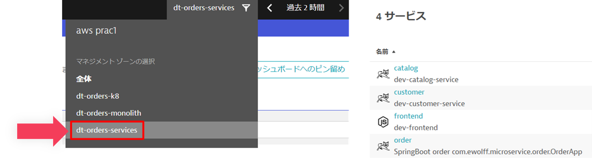
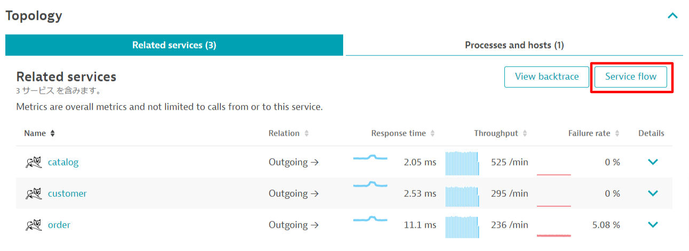
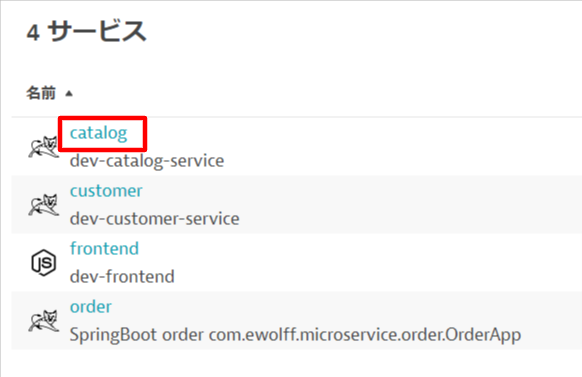

# AWS Lab 2 - コンテナ環境へのモダナイゼーション

## 概要

このラボでは、2つ目のEC2インスタンスでアプリケーションの更新バージョンを使用します。 これにより、ラボ1のサンプルアプリケーションの変換を簡単に確認できます。

### このセクションの目的

🔷 サンプルアプリがどのように複数のサービスを利用しているかを確認する。

🔷 サービスフローとバックトレースを使用して、変換されたアプリケーションを評価する。

## 構成

先ほど見たように、サンプル・アプリケーションは、フロントエンド、バックエンド、データベースの3層構造になっています。

リホスティング（リフト＆シフトとも呼ばれる）は、一般的な移行ユースケースです。リアーキテクチャとリプラットフォームは、従来のアーキテクチャを壊し、個々のコンポーネントをクラウドサービスやマイクロサービスに置き換えるステップと言えるでしょう。

Dynatrace と OneAgent を使用して、サービス、プロセス、およびユーザーリクエストに関する優れた情報を取得する方法を学びました。これは、モダナイゼーションする必要がある、ビジネス上の利点に基づく個々の機能またはアプリケーション全体を決定するのに役立ちます。ここでの考え方は、機能的な移行で機能ベースのビジネス上のメリットに焦点を当てることです。

このラボでは、バックエンドサービスを複数のサービスに分割したサンプルアプリケーションを使用します。これらのサービスをDockerイメージにすることで、Kubernetesのような最新のプラットフォームや、以下に示すようなクラウドマネージドサービスにサービスをデプロイできるようになります。

**#1 . サンプルアプリケーション**

このラボでは、Dockerコンテナとして実装されたフロントエンドと複数のバックエンドサービスで構成されたサンプルアプリを利用します。

**#2 . Dynatrace環境**

Lab0のプロビジョニングスクリプト内でDynatrace OneAgentはホストにインストール済みです。データはすでに送られておりSaaS側では収集を開始しています。

**#3 . JMeterプロセス**

Lab1同様バックグラウンドでトラフィックを生成するために<a href="https://github.com/dt-orders/load-traffic" target="_blank">JMeter</a> が動作しています。

## サンプルアプリ

### サンプルアプリのパブリックIPアドレスの確認

パブリックIPアドレスを確認するためにAWSコンソールの`EC2インスタンス`ページにアクセスします。`dt-orders-services`インスタンスの詳細タブから`パブリックIPv4アドレス`を確認します。

### サンプルアプリへのアクセス

アプリケーションを確認するためにパブリックIPアドレスをコピーして、アドレスバーに貼り付けます。このとき`HTTPS`ではなく`HTTP`でアクセスするようにしてください。

### 💥 **TECHNICAL NOTE**

Lab1との違いは、バックエンド・サービスのバージョンのリストです。この点については、ラボの後半で改めて説明します。

## サービス

左側のDynatraceメニューの`アプリケーションオブザーバビリティ > サービス`をクリックして、サービスを見てみましょう。

マネジメントゾーンのドロップダウンで、`dt-orders-services`を選択します。フィルタリングされたリストはこのようになるはずです：

`frontend`サービスを開きます。

### サービスフロー分析

フロントエンドのサービスに移ったので、サービスフローを見て何が変わったか見てみましょう。`Service flow`ボタンをクリックしてください。

### 応答時間の観点

`サービスフロー`のページになります。

アプリケーションがどのような構造になっているかが一目で確認することができます。

* **frontend**は**order**、**customer**、**catalog**の3つのサービスを呼び出しています。
* **order**サービスは**catalog**と**customer**サービスを呼び出しています。

このような情報はメトリクスやログからは決して見えない情報です。

上の画像において：

1. **応答時間**の観点でデータを表示しています。**スループット**の観点に切り替えることができます。
1. `order`ボックスをクリックすると、レスポンスタイムのメトリクスが展開されます。`order`サービスが呼び出している**catalog**と**customer**サービスは応答時間に対して同程度影響していることが分かります。そして、モノリス版のアプリケーションと同じように、レスポンスタイムに占めるデータベースの時間はわずかであることがわかります。

### スループットの観点

上の画像において：

1. ボックスをクリックして、**スループット**視点に変更します。
1. ボックスをクリックすると、応答時間のメトリクスが展開されます。

### サービスバックトレースの確認

それでは、左側のメニューの `アプリケーションオブザーバビリティ > サービス` をクリックして、サービス一覧を表示しましょう。
今度は`catalog`をクリックします。

`catalog`サービス画面で、`View backtrace`ボタンをクリックします。

`catalog`サービスがどのように呼び出されているか確認してみましょう。

1. スタートのポイントは`catalog`になります。
1. `catalog`は`order`サービスから呼び出されています。
1. `catalog`は`frontend`サービスから呼び出されています。
1. `frontend`は`My web application`からへのブラウザのトラフィックが確認できます。 もし表示されなくても問題ありません。

### 👍 どのように役立つのか

サービスフローとサービスバックトレースを使用することで、これら2つのツールは、ホスト、プロセス、サービス、およびアプリケーションの観点から、アーキテクチャの残りの部分との相互依存関係を完全に把握することができます。

### 👍 モノリスアーキテクチャとの違いの把握

Lab1で確認した`frotnend`のサービスフローと本ラボの`frontend`のサービスフローの違いを確認してみましょう。また、Lab1で確認した`backend`のバックトレースと本ラボの`catalog`のバックトレースの違いを確認してみましょう。

## 本セッションのまとめ

クラウドに移行する際、移行が計画通りに進んでいるか、サービスが以前と同じように、あるいはそれ以上に機能しているか、新しいアーキテクチャが計画通りの効率性かどうかを評価したいものです。Dynatraceは、これらのすべてのステップを自動的に検証し、移行と検証のプロセスをスピードアップするのに役立ちます。

サービスフローを理解する能力を持つことで、リアーキテクチャやリプラットフォームの意思決定をよりスマートに行うことができます。Kubernetesのような新しいテクノロジーをサポートすることで、新旧にまたがるプラットフォームでモダナイゼーションを安心して行えるようになりました。

時間が経つにつれて、このサンプルアプリケーションは、[AWS Lambda](https://aws.amazon.com/lambda/)や[AWS Relational Database Service (RDS)](https://aws.amazon.com/rds/)や[Amazon Aurora - MySQLおよびPostgreSQL互換リレーショナルデータベース](https://aws.amazon.com/rds/aurora)や[Amazon API Gateway](https://aws.amazon.com/api-gateway/)のような他のサービスのような他の技術を追加し、さらに変更されることが想像できます。

### 💥 **TECHNICAL NOTE**

ここでは取り上げませんが、組織はDevOpsアプローチを確立し、継続的インテグレーション（CI）パイプラインを確立して、各サービスを独立してビルドしテストしています。そして、そのプロセスに継続的デプロイメント（CD）を追加することで、顧客への迅速な機能提供能力を大幅に向上させることができます。 Dynatraceは、DevOpsをサポートする多くのソリューションを持っています。詳しくは[こちら](https://www.dynatrace.com/solutions/devops/)をご覧ください。

### チェックリスト

このセクションで、あなたは以下を確認しました：

✅ 複数のサービスから構成されたサンプルアプリを監視できていることを確認

✅ サービスフローとバックトレースを用いて、サンプルアプリの構造を理解
