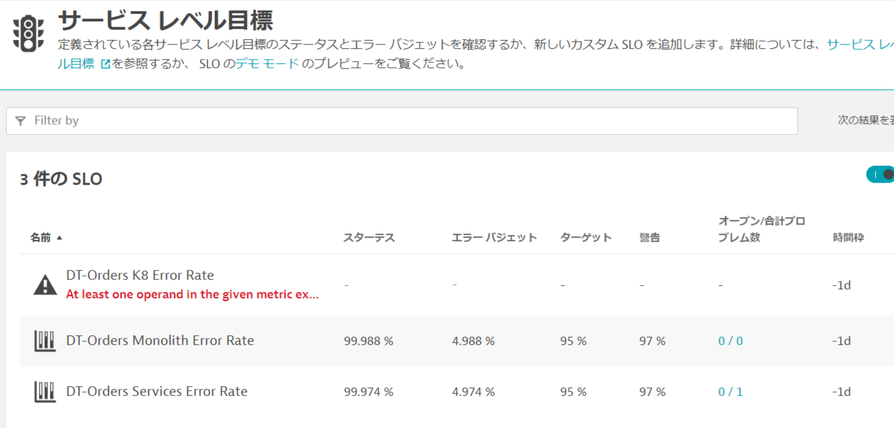

# AWS Lab 3 - SLOs

## 概要

より少ないリソースでより多くのことを行い、規模を拡大するためには、組織はITサイロを超え、コラボレーションを促進し、生産性を向上させなければなりません。自動化と共通のデータ・モデルはそのための重要な要素ですが、それには運用チームとワークフローをサポートするプラットフォームが必要です。

### 本セッションの目的

🔷 Dynatraceのサービスレベル目標 (SLOs)の確認

🔷 ダッシュボードによるSLOの確認

## サービスレベル目標

Dynatraceは、サイトリライアビリティエンジニアリング（SRE）チームが定義した目標を監視するために必要な情報をリアルタイムに提供します。

SRE チームは、あるサービスの信頼性の高いデリバリを監視するために、そのサービスに対する適切なサービスレベル指標（SLI）を見つける責任があります。そして、SLI はサービスごとに異なります。すべてのサービスが時間やエラーの制約という点で同じようにクリティカルであるとは限らないからです。

**Dynatraceは、専用のSLIとして使用できる2000種類以上のメトリクスを提供しています。**

各SLOは、2つの指標によって評価することができます：

* **SLOステータス:** SLO の現在の評価結果をパーセンテージで表したもの。このパーセンテージの意味（例えば、全サービス要求の 99.3%が成功した、または全ウェブサイトユーザーの 99.99%が Apdex 評価で「満足」したなど）、およびこのパーセンテージに定義される目標は、SRE チーム次第である。

* **エラーバジェット:** 不合格と見なされる指標が残りどれぐらいバッファがあるのかを表したもの。たとえば、ある SLO は 95%の目標を定義し、現在の SLO ステータスが 98%と評価される場合、残りのエラーバジェットはSLO ステータスとSLO（98-95=3%）の差になります。

### SLOの確認

**本ハンズオンではSLOについては設定済みです。**

Dynatrace の左メニューから、`オートメーション > Service-Level Objectives` オプションをクリックして、すでに設定されている3つのSLOを確認します。そのうちの 1 つを編集して、設定を確認します。
(Management Zoneの設定をしている場合は`全体`を選択します)

### 👍 どのように役立つのか

SLOの概要ページでは、現在の健康状態、エラー予算、目標、警告、およびすべてのSLOの時間枠を確認することができます。

Davisは検出された異常について、対処可能な根本原因とともに迅速に通知します。SLOが赤になった場合、Davisがすでに根本的なメトリクスの問題を提起し、根本原因を示していることがほとんどです。

### 💥 **TECHNICAL NOTE**

さらに詳しく知りたい方は[Service-level objectives](https://www.dynatrace.com/support/help/shortlink/objectives-hub)をご確認ください。

## SLOダッシュボードの確認

左のメニューバーから`お気に入り > ダッシュボード`を開きます。
もし、お気に入り内にダッシュボードが見つからない場合は、`観察と探索 > ダッシュボード`を開きます。
`Cloud Migration Success`ダッシュボードを開きます。
ダッシュボードが表示されます。

### ダッシュボードの編集

ダッシュボードを編集し、SLO に関するタイルを調整します。

画面右上の`編集`ボタンをクリックし、以下のステップを実行します。

### Dynamic requests タイルの編集

1. **Dynamic requests**タイルをクリックします。右側にプロパティを開きます。
1. プロパティウィンドウにて`frontend (monolith-frontend)`サービスを選びます。
1. `完了`ボタンをクリックします。

### 残りのタイルの編集

1. **Multi Service**タイルで上記と同じ手順を繰り返しますが、プロパティウィンドウでは`frontend (dev-frontend)`を選びます。
1. SLO プロパティウィンドウのドロップダウンリストから、関連する SLO を選択します。
1. 2つのデータベース・タイルについても繰り返します。**Cloud Service**には3つのデータベースがあるので、任意のデータベースから1つを選んでください。
1. `完了`ボタンをクリックすることでダッシュボードを保存します。

## 本セッションのまとめ

本セッションでは、SREが利用するSLOについてDynatraceでの確認方法について学びました。SLOの設定方法について興味のある方は[Configure a service-level objective](https://www.dynatrace.com/support/help/shortlink/service-level-objectives#config)を参照ください。

また、SRE向けにSLOをまとめたダッシュボードを作ることも可能です。

### チェックリスト

このセクションでは以下を確認しました：

✅ Dynatraceのサービスレベル目標（SLO）の確認方法

✅ダッシュボードによる SLOの確認方法
